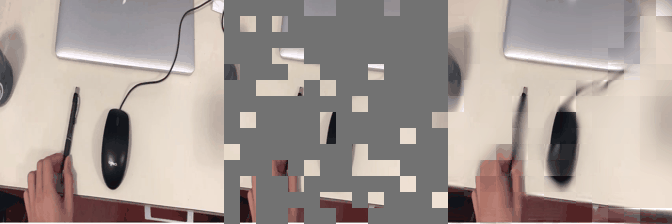
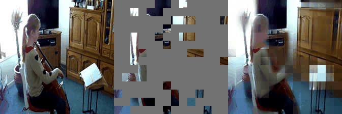
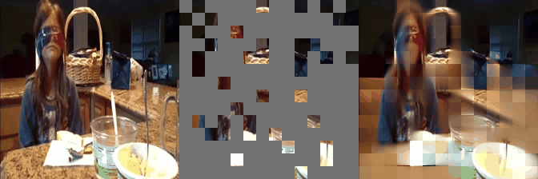
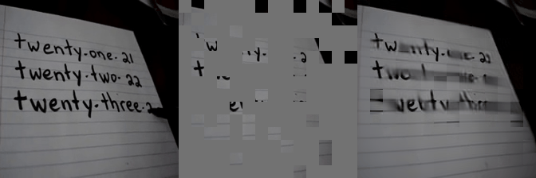
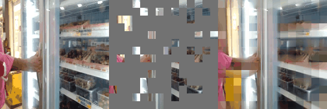
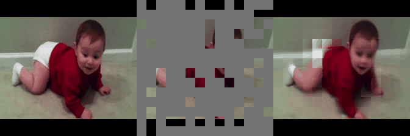

# VideoMAE


[](https://twitter.com/search?q=%23FreePalestine&src=typed_query)

[](https://arxiv.org/abs/2203.12602) []([?](https://img.shields.io/badge/keras-2.12-darkred)) [](https://colab.research.google.com/drive/1BFisOW2yzdvDEBN_0P3M41vQCwF6dTWR?usp=sharing) [](https://huggingface.co/spaces/innat/VideoMAE) [](https://huggingface.co/innat/videomae)

Video masked autoencoders (**VideoMAE**) are seen as data-efficient learners for self-supervised video pre-training (SSVP). Inspiration was drawn from the recent [ImageMAE](https://arxiv.org/abs/2111.06377), and customized video tube masking with an extremely high ratio was proposed. Due to this simple design, video reconstruction is made a more challenging self-supervision task, leading to the extraction of more effective video representations during this pre-training process. Some hightlights of **VideoMAE**: 

- **Masked Video Modeling for Video Pre-Training**
- **A Simple, Efficient and Strong Baseline in SSVP**
- **High performance, but NO extra data required**

This is a unofficial `Keras` implementation of [VideoMAE: Masked Autoencoders are Data-Efficient Learners for Self-Supervised Video Pre-Training](https://arxiv.org/abs/2203.12602) model. The official `PyTorch` implementation can be found [here](https://github.com/MCG-NJU/VideoMAE).

## News

- **[9-10-2023]**: TensorFlow [SavedModel](https://www.tensorflow.org/guide/saved_model) (formet) checkpoints, [link](https://github.com/innat/VideoMAE/releases/tag/v1.1).
- **[6-10-2023]**: VideoMAE integrated into [Huggingface Space](https://huggingface.co/spaces/innat/VideoMAE).
- **[4-10-2023]**: VideoMAE checkpoints [SSV2](https://developer.qualcomm.com/software/ai-datasets/something-something) and [UCF101](https://www.crcv.ucf.edu/data/UCF101.php) becomes available, [link](https://github.com/innat/VideoMAE/releases/tag/v1.0).
- **[3-10-2023]**: VideoMAE checkpoints on [Kinetics-400](https://www.deepmind.com/open-source/kinetics) becomes available, [link](https://github.com/innat/VideoMAE/releases/tag/v1.0).
- **[29-9-2023]**: GPU(s), TPU-VM for fine-tune training are supported.
- **[27-9-2023]**: Code of VideoMAE in Keras becomes available. 


# Install 

```bash
git clone https://github.com/innat/VideoMAE.git
cd VideoMAE
pip install -e . 
```

# Usage

There are many variants of **VideoMAE** mdoels available, i.e. `small`, `base`, `large`, and `huge`. And also for benchmark data specific, i.e. [Kinetics-400](https://www.deepmind.com/open-source/kinetics), [SSV2](https://developer.qualcomm.com/software/ai-datasets/something-something), and [UCF101](https://www.crcv.ucf.edu/data/UCF101.php). Check this [release](https://github.com/innat/VideoMAE/releases/tag/v1.0) and [model zoo](https://github.com/innat/VideoMAE/blob/main/MODEL_ZOO.md) page to know details of it.

## Pre-trained Masked Autoencoder

Only the inference part is provided for **pre-trained** VideoMAE models. Using the trained checkpoint, it would be possible to reconstruct the input sample even with high mask ratio. For end-to-end workflow, check this [reconstruction.ipynb](notebooks/reconstruction.ipynb) notebook. Some highlights:

```python
from videomae import VideoMAE_ViTS16PT

# pre-trained self-supervised model
>>> model = VideoMAE_ViTS16PT(img_size=224, patch_size=16)
>>> model.load_weights('TFVideoMAE_B_K400_16x224_PT.h5')

# tube masking
>>> tube_mask = TubeMaskingGenerator(
    input_size=window_size, 
    mask_ratio=0.80
)
>>> make_bool = tube_mask()
>>> bool_masked_pos_tf = tf.constant(make_bool, dtype=tf.int32)
>>> bool_masked_pos_tf = tf.expand_dims(bool_masked_pos_tf, axis=0)
>>> bool_masked_pos_tf = tf.cast(bool_masked_pos_tf, tf.bool)

# running
>>> container = read_video('sample.mp4')
>>> frames = frame_sampling(container, num_frames=16)
>>> pred_tf = model(frames, bool_masked_pos_tf)
>>> pred_tf.numpy().shape
TensorShape([1, 1176, 1536])
```

A reconstructed results on a sample from [SSV2](https://developer.qualcomm.com/software/ai-datasets/something-something) with `mask_ratio=0.8`



## Fine Tuned Model

With the **fine-tuned** VideoMAE checkpoint, it would be possible to evaluate the benchmark datast and also retraining would be possible on custom dataset. For end-to-end workflow, check this quick [retraining.ipynb]() notebook. It supports both multi-gpu and tpu-vm retraining and evaluation. Some highlights:

```python
from videomae import VideoMAE_ViTS16FT

>>> model = VideoMAE_ViTS16FT(img_size=224, patch_size=16, num_classes=400)
>>> container = read_video('sample.mp4')
>>> frames = frame_sampling(container, num_frames=16)
>>> y = model(frames)
>>> y.shape
TensorShape([1, 400])

>>> probabilities = tf.nn.softmax(y_pred_tf)
>>> probabilities = probabilities.numpy().squeeze(0)
>>> confidences = {
    label_map_inv[i]: float(probabilities[i]) \
    for i in np.argsort(probabilities)[::-1]
}
>>> confidences
```
A classification results on a sample from [Kinetics-400](). 

| Video | Top-5 |
|:---:|:---|
|  | <pre>{<br>    'playing_cello': 0.6552159786224365,<br>    'snowkiting': 0.0018940207082778215,<br>    'deadlifting': 0.0018381892004981637,<br>    'playing_guitar': 0.001778001431375742,<br>    'playing_recorder': 0.0017528659664094448<br>}</pre> |


# Model Zoo

The pre-trained and fine-tuned models are listed in [MODEL_ZOO.md](MODEL_ZOO.md). Following are some hightlights.

### Kinetics-400

For Kinetrics-400, VideoMAE is trained around **1600** epoch without **any extra data**. The following checkpoints are available in both tensorflow `SavedModel` and `h5` format.


| Backbone | \#Frame | Top-1 | Top-5 | Params [FT] MB | Params [PT] MB) | FLOPs |
 | :--: | :--: | :---: | :---: | :---: | :---: |  :---: |
  ViT-S    | 16x5x3  | 79.0 | 93.8   | 22 | 24 |  57G |
  ViT-B    | 16x5x3  | 81.5  | 95.1  | 87 | 94 |  181G |
  ViT-L    | 16x5x3  | 85.2  | 96.8  | 304 | 343 |  - |
  ViT-H    | 16x5x3  | 86.6 | 97.1   | 632 | ? |  - |

<sup>?* Official `ViT-H` backbone of VideoMAE has weight issue in pretrained model, details https://github.com/MCG-NJU/VideoMAE/issues/89.</sup>
<sup>The FLOPs of encoder models (FT) are reported only.</sup>


### Something-Something V2

For SSv2, VideoMAE is trained around **2400** epoch without **any extra data**.

| Backbone | \#Frame | Top-1 | Top-5 | Params [FT] MB | Params [PT] MB | FLOPs |
| :------: | :-----: | :---: | :---: | :---: | :---: | :---: |
|  ViT-S    | 16x2x3 | 66.8 | 90.3 | 22 | 24 |  57G |
|  ViT-B    | 16x2x3 | 70.8  | 92.4  | 86 | 94 |  181G |


### UCF101

For UCF101, VideoMAE is trained around **3200** epoch without **any extra data**.

| Backbone | \#Frame | Top-1 | Top-5 | Params [FT] MB | Params [PT] MB | FLOPS |
| :---: | :-----: | :---: | :---: | :---: | :---: | :---: |
|  ViT-B   |  16x5x3  | 91.3 |  98.5 | 86 | 94 |  181G |


# Visualization 

Some reconstructed video sample using **VideoMAE** with different mask ratio.


| Kinetics-400-testset | mask |
| :---: | :-----: |
|    | 0.8  |  
|   | 0.8  | 
|   | 0.9  |
|   | 0.9  |

| SSv2-testset | mask |
| :---: | :-----: |
|    | 0.9  |  
|    | 0.9  |  

| UCF101-testset | mask |
| :---: | :-----: | 
|    | 0.8  | 
|    | 0.9  |  

# TODO

- [x] Custom fine-tuning code.
- [ ] Publish on TF-Hub.
- [ ] Support `Keras V3`to support multi-framework backend.


##  Citation

If you use this videomae implementation in your research, please cite it using the metadata from our `CITATION.cff` file. 

```python
@inproceedings{tong2022videomae,
  title={Video{MAE}: Masked Autoencoders are Data-Efficient Learners for Self-Supervised Video Pre-Training},
  author={Zhan Tong and Yibing Song and Jue Wang and Limin Wang},
  booktitle={Advances in Neural Information Processing Systems},
  year={2022}
}
```
