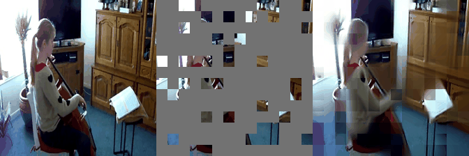

# VideoMAE


[](?) [](?) [](?) [](?)

This is a `Keras` reimplementation of [VideoMAE: Masked Autoencoders are Data-Efficient Learners for Self-Supervised Video Pre-Training](https://arxiv.org/abs/2203.12602) model. The official `PyTorch` implementation can be found [here](https://github.com/MCG-NJU/VideoMAE).


## Pre Trained Self-Supervised Model

```python

from videomae import VideoMAE_ViTS16PT

# pre-trained self-supervised model
>>> model = VideoMAE_ViTS16PT(num_classes=400)

# tube masking
>>> tube_mask = TubeMaskingGenerator(
    input_size=window_size, 
    mask_ratio=0.75
)
>>> make_bool = tube_mask()
>>> bool_masked_pos_tf = tf.constant(make_bool, dtype=tf.int32)
>>> bool_masked_pos_tf = tf.expand_dims(bool_masked_pos_tf, axis=0)
>>> bool_masked_pos_tf = tf.cast(bool_masked_pos_tf, tf.bool)

# running
>>> pred_tf = model(
    tf.ones(shape=(1, 16, 224, 224, 3)), bool_masked_pos_tf
)
>>> pred_tf.numpy().shape
TensorShape([1, 1176, 1536])
```

## Fine Tuned Model

```python
from videomae import VideoMAE_ViTS16FT

>>> model = VideoMAE_ViTS16FT(num_classes=400)
>>> y = model(np.ones((1, 16, 224, 224, 3)))
>>> y.shape
TensorShape([1, 400])
```


# Model Zoo

The pre-trained and fine-tuned models are listed in [MODEL_ZOO.md](MODEL_ZOO.md).


# Visualization 

Masked Autoencoder with `mask_ratio=0.8` from pretrained self-supervised video-mae model.




# XLA Compatible

All the variants of converted videomae `keras` models are XLA compatible. They are evaluated on **TPU-VM** to reproduce the official reported scores.

# TODO

- [x] Multi-GPU suppport.
- [x] TPU support.
- [ ] Self-supervised training mechanism.
- [ ] Convert to `Keras V3`to support multi-framework backend.
